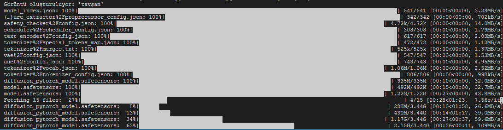

# 🎨 AI Görsel Oluşturma Yazılımı

Bu proje, çeşitli yapay zeka teknolojileri kullanarak görsel içerik oluşturma, dönüştürme ve video üretme işlemlerini gerçekleştiren kapsamlı bir araçtır. Stable Diffusion modelleriyle yaratıcı görseller üretebilir, mevcut görselleri dönüştürebilir ve görselleri videolara çevirebilirsiniz.

## 📋 İçindekiler
- [Özellikler](#-özellikler)
- [Kurulum](#-kurulum)
- [Kullanım](#-kullanım)
- [Detaylı Kullanım Senaryoları](#-detaylı-kullanım-senaryoları)
- [Kullanılan Teknolojiler](#-kullanılan-teknolojiler)
- [Sorun Giderme](#-sorun-giderme)
- [Yapılandırma Detayları](#-yapılandırma-detayları)



## 🔥 Özellikler

- **Metin → Görsel (txt2img)**: Metin açıklamasından detaylı görsel oluşturma
  - Prompt yönlendirme gücü ayarlama
  - Diffusion adım sayısı kontrolü
  - Çeşitli sanatsal stillerde içerik oluşturma

- **Görsel → Görsel (img2img)**: Mevcut görselleri dönüştürme ve geliştirme
  - Değişim miktarı kontrolü
  - Stil transferi
  - İçerik uyarlama ve yeniden yorumlama

- **Görsel → Video (img2vid)**: Durağan görsellerden hareketli videolar oluşturma
  - FPS (saniyedeki kare) ayarı
  - Video uzunluğu kontrolü
  - Hareket miktarı ve türü ayarlama

- **İş Akışları**: Birden fazla tekniği birleştiren hazır iş akışları
  - Basit iş akışı: Temel görsel oluşturma
  - Stil Transferi: Farklı sanatsal stillerde oluşturma
  - Gelişmiş Düzenleme: Detay, renk ve ışık varyasyonları oluşturma

## 🚀 Kurulum

### Sistem Gereksinimleri

- **İşletim Sistemi**: Linux, macOS veya Windows
- **Python**: 3.8 veya üzeri
- **Bellek**: En az 8GB RAM (16GB önerilir)
- **GPU**: NVIDIA GPU (CUDA destekli) önerilir ancak zorunlu değil
- **Disk Alanı**: En az 10GB boş alan (modeller için)

### Hızlı Kurulum (Önerilen)

```bash
# Tek komutla tam otomatik kurulum ve başlatma
chmod +x run.sh
./run.sh --auto --install

# Kurulum sonrası normal çalıştırma
./run.sh
```

### Manuel Kurulum

1. **Sistem Kütüphanelerini Kur**:

   Ubuntu/Debian sistemleri için:
   ```bash
   sudo apt-get update
   sudo apt-get install -y libgl1-mesa-glx libglib2.0-0 libsm6 libxrender1 libxext6 python3-dev python3-pip python3-venv ffmpeg
   ```

   CentOS/RHEL/Fedora için:
   ```bash
   sudo yum install -y mesa-libGL glib2 libSM libXrender libXext python3-devel python3-pip ffmpeg
   ```

2. **Python Sanal Ortam Oluştur**:
   ```bash
   python3 -m venv venv
   source venv/bin/activate
   ```

3. **Python Bağımlılıklarını Kur**:
   ```bash
   pip install --upgrade pip setuptools wheel
   pip install -r requirements.txt
   ```

## 🎮 Kullanım

### Komut Satırı Seçenekleri

```bash
# Temel Kullanım
./run.sh                       # Normal çalıştırma

# Kurulum Seçenekleri
./run.sh --install             # Gerekli bağımlılıkları kur
./run.sh --auto --install      # Soru sormadan otomatik kurulum yap

# Çalıştırma Seçenekleri
./run.sh --share               # İnternet üzerinden paylaş (URL oluştur)
./run.sh --port 8080           # Belirli port numarasıyla çalıştır
./run.sh --share --port 8888   # Paylaşım ve özel port ile çalıştır

# Yardım
./run.sh --help                # Yardım mesajını göster
```

### Web Arayüzü

Program başlatıldıktan sonra, web tarayıcınızda otomatik olarak arayüz açılacaktır. Eğer açılmazsa, tarayıcınızda aşağıdaki adresi ziyaret edin:
```
http://localhost:7860
```

## 📝 Detaylı Kullanım Senaryoları

### 1. Metin → Görsel Oluşturma

1. "Metin → Görsel" sekmesine tıklayın
2. Görsel açıklamasını girin (örn: "Deniz kenarında gün batımı, yağlı boya tarzında")
3. Prompt yönlendirme gücünü ayarlayın (7.5 iyi bir başlangıç değeridir)
4. Diffusion adımlarını ayarlayın (daha fazla adım = daha kaliteli sonuç ama daha yavaş işlem)
5. "Görsel Oluştur" butonuna tıklayın
6. Sonuç görselini kaydedebilir veya tekrar düzenleyebilirsiniz

### 2. Görsel → Görsel Dönüştürme

1. "Görsel → Görsel" sekmesine tıklayın
2. "Kaynak Görsel" bölümüne bir görsel yükleyin
3. İstediğiniz değişikliği metin olarak açıklayın (örn: "Anime stiline dönüştür")
4. Değişim miktarını ayarlayın (0.1 = minimal değişim, 1.0 = maksimum değişim)
5. "Dönüştür" butonuna tıklayın

### 3. Görsel → Video Oluşturma

1. "Görsel → Video" sekmesine tıklayın
2. "Başlangıç Görseli" bölümüne bir görsel yükleyin
3. Video kare sayısı, FPS ve hareket ölçeğini ayarlayın
4. "Video Oluştur" butonuna tıklayın
5. Oluşturulan videoyu indirebilirsiniz

### 4. İş Akışları Kullanımı

1. "İş Akışı" sekmesine tıklayın
2. Metin açıklamasını girin
3. İş akışı tipini seçin:
   - Basit: Tek bir görsel oluşturur
   - Stil Transferi: Aynı açıklamayı farklı sanatsal stillerde oluşturur
   - Gelişmiş Düzenleme: Farklı detay ve ışık varyasyonları oluşturur
4. "İş Akışını Çalıştır" butonuna tıklayın

## 🔧 Kullanılan Teknolojiler

### Ana AI Modelleri ve Kütüphaneler

| Kütüphane | Sürüm | Kullanım Amacı |
|-----------|-------|----------------|
| **torch** | >=2.0.0 | PyTorch: Derin öğrenme modelleri için temel kütüphane |
| **diffusers** | >=0.18.0 | Diffusion modelleri: Stable Diffusion'ı çalıştırır |
| **transformers** | >=4.30.0 | Hugging Face Transformers: NLP ve görsel işleme için modeller |
| **accelerate** | >=0.20.0 | Hesaplama hızlandırma: İşlemleri hızlandırır |

### Web Arayüzü

| Kütüphane | Sürüm | Kullanım Amacı |
|-----------|-------|----------------|
| **gradio** | >=3.32.0 | Web arayüzü oluşturma: Kullanıcı arayüzünü sağlar |

### Görsel ve Video İşleme

| Kütüphane | Sürüm | Kullanım Amacı |
|-----------|-------|----------------|
| **pillow** | >=9.0.0 | PIL: Görsel işleme ve manipülasyon |
| **opencv-python** | >=4.7.0 | OpenCV: Gelişmiş görsel işleme |
| **moviepy** | >=1.0.0 | Video oluşturma ve düzenleme |

### Yardımcı Kütüphaneler

| Kütüphane | Sürüm | Kullanım Amacı |
|-----------|-------|----------------|
| **numpy** | >=1.24.0 | Matematiksel işlemler |
| **psutil** | >=5.9.0 | Sistem bilgisi izleme |
| **nvidia-ml-py3** | * | GPU izleme ve optimizasyon |

## 💡 Sorun Giderme

### GPU Sorunları

- **GPU Algılanmıyor**
  - NVIDIA sürücüleri düzgün yüklendiğini kontrol edin: `nvidia-smi`
  - CUDA kurulu olduğunu doğrulayın: `nvcc --version`
  - PyTorch'un CUDA destekli olarak kurulduğunu kontrol edin

- **CUDA Bellek Hatası**
  - Daha az bellek kullanan ayarlarla deneyin (daha düşük çözünürlük veya batch size)
  - Gereksiz programları kapatın
  - `--auto` seçeneği ile çalıştırarak otomatik optimizasyonları aktifleştirin

### OpenGL Hataları

```
libGL.so.1: cannot open shared object file: No such file or directory
```

Bu hata için:
```bash
# Ubuntu/Debian
sudo apt-get install -y libgl1-mesa-glx

# CentOS/RHEL/Fedora
sudo yum install -y mesa-libGL
```

### Python Paket Sorunları

- **MoviePy Bulunamıyor**
  ```bash
  pip install moviepy
  ```

- **Torch Versiyonu Uyumsuzluğu**
  ```bash
  pip uninstall torch
  pip install torch>=2.0.0
  ```

### Stable Diffusion Tıkanma Sorunları

Eğer "Loading pipeline components... 100%" mesajından sonra ilerleme çubuğu %0'da kalıyorsa veya görsel oluşturma başlamıyorsa:

1. **Düşük Bellek Modu ile Çalıştırma**:
   ```bash
   ./run.sh --low-memory
   ```
   Bu mod, daha az GPU belleği kullanır ancak işlem daha yavaş olabilir.

2. **Debug Modu ile Sorun Tespiti**:
   ```bash
   ./run.sh --debug
   ```
   Bu mod, sorunu tanımlamak için daha detaylı log bilgileri gösterir.

3. **Adım Sayısını Azaltın**: Web arayüzünde "Diffusion Adımları" ayarını 20-30 civarına düşürün.

4. **GPU Bellek Temizliği**:
   ```bash
   # Diğer GPU işlemlerini sonlandırın
   nvidia-smi --gpu-reset
   
   # Sonra uygulamayı yeniden başlatın
   ./run.sh
   ```

## ⚙️ Yapılandırma Detayları

### Modeller

Uygulama ilk çalıştırmada otomatik olarak gerekli modelleri indirir:

- **Stable Diffusion v1.5**: Metin ve görsel dönüştürme için temel model
- **CLIP**: Metin anlama ve görsel yorumlama için kullanılır
- **VAE**: Detaylı görüntü oluşturma için kullanılır

Modeller `~/.cache/huggingface/` dizininde saklanır ve yaklaşık 4-5 GB disk alanı kaplar.

### Özelleştirme

Gelişmiş kullanıcılar için, model ve parametre ayarları şu dosyalarda değiştirilebilir:

- `txt2img.py`: Metin→görsel için model parametreleri
- `img2img.py`: Görsel→görsel dönüşüm ayarları
- `img2vid.py`: Video oluşturma parametreleri

### GPU Hafıza Kullanımı

- **txt2img**: ~4-6 GB
- **img2img**: ~4-6 GB
- **img2vid**: ~2-4 GB

Bellek kullanımı, görsel boyutu ve model parametrelerine bağlı olarak değişir.

## 🧠 Teknoloji Detayları

### Stable Diffusion Modeli Nasıl Çalışır?

Stable Diffusion, görsel oluşturmayı birkaç aşamada gerçekleştirir:

1. **Metin Kodlama**: CLIP modeli ile metin açıklaması kodlanır
2. **Gürültü Oluşturma**: Rastgele gürültü üretilir
3. **Gürültü Azaltma**: İteratif bir süreçle gürültü azaltılır ve görsel oluşturulur
4. **Görsel Çözünürlük Artırma**: VAE ile görsel detaylandırılır

### img2img Tekniği

img2img, mevcut bir görsele kontrollü bir şekilde gürültü ekleyip Stable Diffusion'ın bu gürültüyü temizleyerek görüntüyü dönüştürmesini sağlar. Gürültü miktarı "strength" parametresiyle kontrol edilir.

### img2vid İşlemi

Uygulamamızda, tek bir görselden video oluşturmak için basit bir animasyon tekniği kullanıyoruz. Görsel üzerinde çeşitli dönüşümler (kaydırma, döndürme) uygulayarak hareket illüzyonu yaratılır.

## 🚀 Gelişmiş Kullanım

Bellek sorunlarıyla uğraşanlar için ek parametreler:

```bash
# Debug ve düşük bellek modu birlikte
./run.sh --debug --low-memory

# Bellek kullanımını optimize et ve internet üzerinden paylaş
./run.sh --low-memory --share

# Alternatif port ve düşük bellek modu
./run.sh --port 8080 --low-memory
```

## 🚩 Gelecek Güncellemeler

- Daha gelişmiş video oluşturma
- Yüz değiştirme ve yüz animasyonu
- Kişiselleştirilmiş model eğitimi
- Batch işleme desteği
- Daha gelişmiş stil transferi
